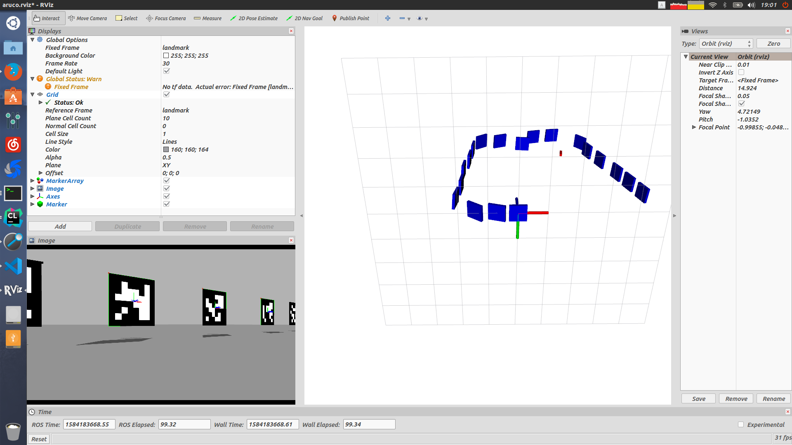

# Using Aruco Localization 

## Reference Work

ArUco EKF SLAM `https://github.com/ydsf16/aruco_ekf_slam`

Aruco gazao model `https://github.com/DaojunZhu/gazebo_aruco_models`

## Thridparty Lib
1. g2o
2. opencv3.x.x
3. Eigen
4. Sophus
5. ROS

## Run Shot

## Datasets
The datasets came from the gazebo simulate.

## Remarks
1. The project uses monocular to localize
2. The program still has some problem, for example, low positioning accuracy.
   

